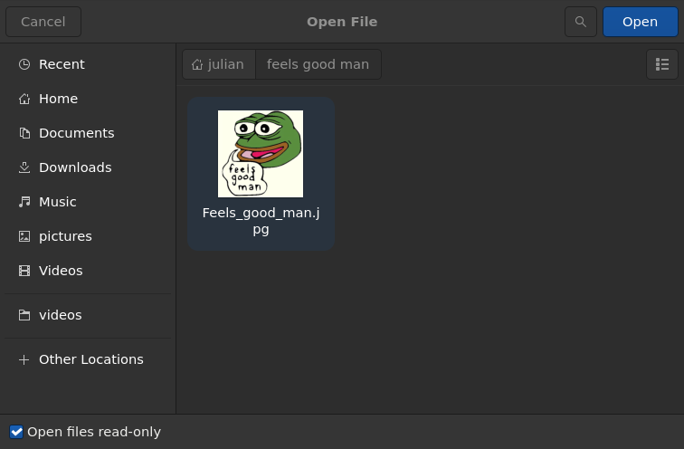

# xdg-desktop-portal-gtk4

This is a portal backend for [xdg-desktop-portal][portal] using GTK4.

If your Wayland compositor would otherwise use the [GTK3 portal][gtk3] (Sway, Jay,
Hyprland, etc.), you can instead use this portal to get thumbnails in the file picker.



[portal]: http://github.com/flatpak/xdg-desktop-portal
[gtk3]: http://github.com/flatpak/xdg-desktop-portal-gtk

## Building & Installing

To build and install the portal, run

```bash
cargo build --release
meson setup build -Dprefix=/usr
sudo meson install -C build
```

## Configuring your Compositor

To make your compositor use the portal, you have to modify its configuration file in

- `/usr/share/xdg-desktop-portal/`

Add

```ini
org.freedesktop.impl.portal.FileChooser=gtk4
```

at the end to explicitly request the GTK4 portal for the file picker.

For example

```diff
--- jay-portals.conf.old    2024-09-20 14:55:49.029327860 +0200
+++ jay-portals.conf        2024-09-20 14:55:54.699731749 +0200
@@ -1,5 +1,6 @@
 [preferred]
 default=gtk
 org.freedesktop.impl.portal.ScreenCast=jay
 org.freedesktop.impl.portal.RemoteDesktop=jay
 org.freedesktop.impl.portal.Idle=none
+org.freedesktop.impl.portal.FileChooser=gtk4
```

Restart `xdg-desktop-portal` afterwards to apply the configuration:

```bash
systemctl --user restart xdg-desktop-portal
```

## License

xdg-desktop-portal-gtk4 is free software licensed under the GNU Lesser General Public
License v2.1.
